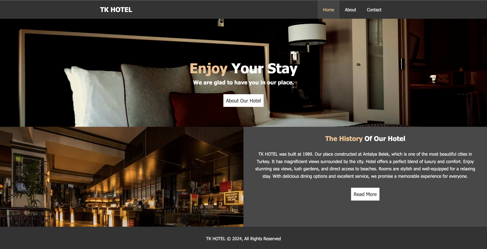
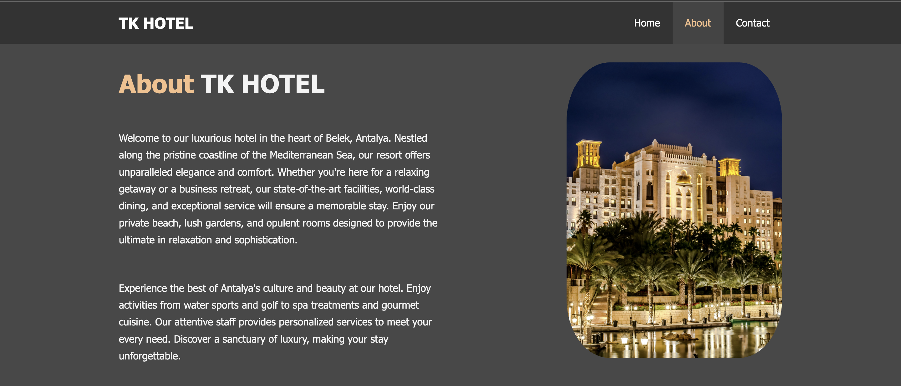
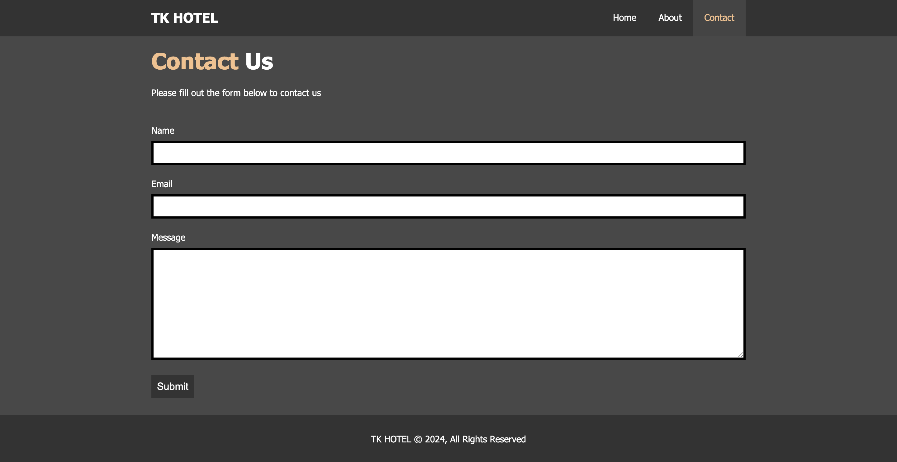

# TK Hotel - Personal Hotel Website

## 📋 Project Overview

TK Hotel is a personal hotel website project developed to improve HTML and CSS skills. This project features a modern, responsive design with elegant styling and showcases luxury hotel services and amenities.

## 🖼️ Website Screenshots

<!-- Image showcase showing different pages -->
<div align="center">

### 🏠 Homepage

<br></br>
<
### ℹ️ About Us Page

### ⭐ Reviews Page

<br></br>

<br></br>
### 📞 Contact Page

<br></br>

</div>

---

### 📱 Page Navigation
| Page | Description | Screenshot |
|------|-------------|------------|
| **Home** | Main landing page with featured amenities | [View](images/anasayfa.png) |
| **About** | Hotel information and facilities | [View](images/hakkında.png) |
| **Contact** | Get in touch with us | [View](images/iletişim.png) |
| **Reviews** | Guest experiences and testimonials | [View](images/yorumlar.png) |

## 🏨 Features

- **Responsive Design**: Works seamlessly across desktop, tablet, and mobile devices
- **Modern UI**: Clean and elegant interface design
- **Professional Layout**: Luxury hotel aesthetic with premium feel
- **Image Gallery**: High-quality hotel and room images
- **Contact Form**: Easy way for guests to make inquiries
- **Guest Reviews**: Testimonials and feedback section

## 📁 Project Structure

```
TK HOTEL/
├── index.html          # Homepage
├── about.html          # About us page
├── contact.html        # Contact page
├── .DS_Store          # System file (macOS)
├── css/
│   └── style.css       # Main stylesheet
└── images/
    ├── küçük.jpg                              # Small room image
    ├── küçükerkek.jpg                         # Male guest image
    ├── küçükkadın.jpg                         # Female guest image
    ├── pexel.jpg                              # Hotel exterior
    ├── pexelorta.jpg                          # Medium room
    ├── pexels-amar-saleem-15661-70441.jpg     # Hotel lobby
    ├── pexels-hasibullah-zhowandai-248954-819530.jpg # Hotel room
    ├── pexels-luizclas-170497-1848565.jpg     # Hotel amenities
    ├── pexels-naimbic-2291636-2.jpg           # Hotel dining
    ├── pexels-osho-1001965.jpg                # Hotel spa
    ├── pexels-pixabay-164595.jpg              # Hotel pool
    ├── pexels-pixabay-258154.jpg              # Hotel reception
    ├── pexels-pixabay-53464.jpg               # Hotel bar
    ├── pexels-recalmedia-60217.jpg            # Hotel restaurant
    └── .DS_Store                              # System file

Root Directory Screenshots:
├── anasayfa.png        # Homepage screenshot
├── hakkında.png        # About page screenshot
├── iletişim.png        # Contact page screenshot
└── yorumlar.png        # Reviews page screenshot
```

## 🛠️ Technologies Used

- **HTML5**: Semantic structure and content organization
- **CSS3**: Advanced styling, animations, and responsive design
- **Responsive Design**: Mobile-first approach for all devices

## 📱 Responsive Features

- Flexible grid layout for different screen sizes
- Mobile-optimized navigation menu
- Scalable hotel and room images
- Adaptive typography and spacing
- Touch-friendly interface elements

## 🎯 Learning Objectives

This project helps develop skills in:

- **HTML5**: Semantic markup, form creation, page structure
- **CSS3**: Flexbox, Grid, animations, responsive design
- **Web Design**: User experience, visual hierarchy, hospitality industry design
- **Project Organization**: Clean file structure and code organization
- **Responsive Development**: Mobile-first design principles

## 🏨 Hotel Features Showcased

- **Room Gallery**: Various room types and accommodations
- **Amenities**: Pool, spa, restaurant, and bar facilities
- **Guest Services**: Reception, dining, and hospitality services
- **Location**: Easy contact and location information
- **Guest Experience**: Reviews and testimonials section

## 🚀 Getting Started

1. Clone or download the project files
2. Open `index.html` in your web browser
3. Navigate through different pages to explore the hotel website
4. Modify the CSS in the `css/style.css` file to experiment with different styles
5. Add your own images to the `images/` folder to customize the gallery

## 📈 Future Enhancements

- [ ] Add online booking system
- [ ] Implement room availability checker
- [ ] Add interactive image gallery with lightbox
- [ ] Include virtual tour functionality
- [ ] Add multi-language support
- [ ] Implement guest review submission form
- [ ] Add hotel amenities booking system
- [ ] Include weather widget for location
- [ ] Add social media integration

## 🎨 Design Elements

- **Color Scheme**: Professional hospitality industry colors
- **Typography**: Elegant and readable font choices
- **Layout**: Clean, spacious design reflecting luxury
- **Images**: High-quality photography showcasing hotel features
- **Navigation**: Intuitive and user-friendly menu system

## 🤝 Contributing

This is a personal learning project, but suggestions and feedback are always welcome!

## 📄 License

This project is for educational purposes and personal skill development.

---

**Note**: This is a learning project focused on improving HTML and CSS skills in the context of hospitality industry web design. The project emphasizes responsive design principles and modern web development practices.

**Contact**: For technical support or collaboration opportunities, please reach out via the contact page or email.
